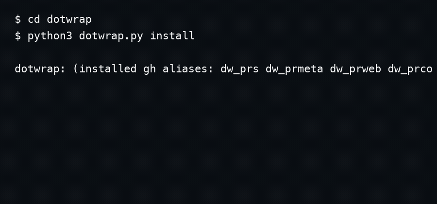

# dotwrap

dotwrap is a tiny installer/uninstaller for a namespaced set of GitHub CLI aliases.

Why it exists:
- I want `gh` workflows that feel like a real CLI, not a browser tab.
- I want shareable aliases without a dotfiles framework.
- I want safe, reversible changes (only touches `dw_` aliases).
- I want something I can keep around for years.

## Install / usage

Install the aliases into `gh` (idempotent):

```bash
python3 dotwrap.py install gh
# provider defaults to gh, so this is also fine:
python3 dotwrap.py install
```

Then use the aliases via `gh`:

```bash
gh dw_prs

gh dw_prmeta 17

gh dw_prweb 17

gh dw_prco 17
```

### `dw_prf` (alpha)

Interactive PR picker powered by `fzf`.

- `enter` → open selected PR in the browser
- `ctrl-o` → checkout the selected PR
- `esc` → quit (exit 0)



## Config

All config lives in `aliases.toml` next to `dotwrap.py`.

Format:

```toml
[providers.gh.aliases]

dw_prs = "..."
dw_prmeta = """ ... """
```

Rules:
- Alias keys must start with `dw_`. If any key doesn’t, dotwrap exits 1.
- Commands are normalized before install: `" ".join(value.split())`.
- Aliases are processed in sorted key order (deterministic installs).

## Uninstall

Remove only the aliases declared in `aliases.toml`:

```bash
python3 dotwrap.py uninstall gh
```

## Testing

```bash
python3 -m unittest discover -s tests -v
```

Tests never call real `gh`: they put a fake `gh` binary on `PATH` and assert the exact subprocess argv that dotwrap sends.

## Non-goals

- Not a dotfiles manager.
- Not a replacement for `gh`.
- Not a secret store (don’t put tokens in alias commands).
